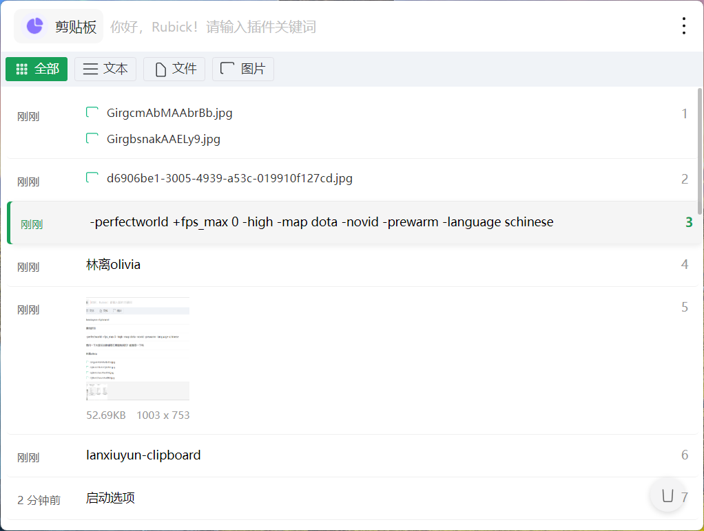

# 已弃用
新剪贴板软件：https://github.com/lanxiuyun/paste-library

## Rubick 剪贴板插件

### 功能

- 记录剪贴板图片
- 记录剪贴板文件
- 记录剪贴板文本
- 收藏剪贴板记录
- 剪贴板图像预览
- 剪贴板搜索

### 使用方法

- 需要先安装 [Rubick](https://github.com/rubickCenter/rubick)
- release 页面 ->下载 zip 文件
- 选择解压到一个好地方，比如：`C:\work_sapce\rubick-jtb`
- 进入到解压目录
- 运行 `npm link`（需要先安装 node.js）
- rubick->插件市场->左下角【开发者】->输入 `lanxiuyun-clipboard` 安装
- 安装完成后，重启 rubick 即可使用
